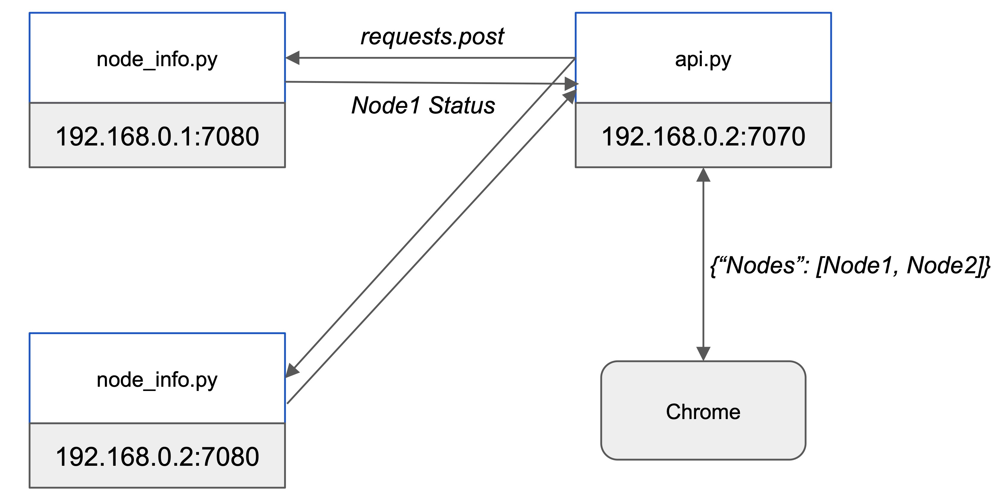

# GPU Cluster Status Monitor

## Introduction

This project aims to provide a HTML interface to display GPU usages of multiple nodes. As shown in Figure 1. The main node poll each GPU node to collect their statuses and make them avaiable to public via API.

<center>

<br>
<div style="color:orange; border-bottom: 1px solid #d9d9d9;
    display: inline-block;
    color: #eee;
    padding: 2px;">Figure 1. Framework</div>
</center>

## Quick Start

Install packages (tested with python=3.9).

```Bash
pip install -r requirments.txt
```

Assume we have a cluster with two nodes (node_1: 192.168.0.1; node_2: 192.168.0.2) and node_1 is the main node to display cluster information.

First, run the script `node_info.py` on each node to start a Flask process. Then node status can be obtained through the api on port 7080 (default):

```Bash
# on node_1, node_2
python node_info.py
```

Before start the cluster monitor, save all node IP addresses in a txt file:

```Bash
> hosts.txt # clear hosts.txt
echo 192.168.0.1 >> hosts.txt
echo 192.168.0.2 >> hosts.txt
```

Second, run the interface API on node_1.

```Bash
python api.py -c hosts.txt --port 7070
```

Then visit `http://192.168.0.1:7070` in Chrome.

### Customize the port

```Bash
# on each node
python node_info.py --port <node_api_port> --disable_log

# on main node
python api.py -c hosts.txt --port <main_api_port> --node_port <node_api_port>

# visit http://<main_node_ip>:<main_api_port>
```

## Specifications

### Password

A password is required to get node status, defaulting to '8888'. To change the password, modify the global variable **PASSWD** in `node_info.py` and `api.py`.

### Get node status (json)

Given `node_info.py` running on `192.168.0.3:7080`, node status data can be acquired by python:

```Python
import requests

res = requests.post(f'http://192.168.0.3:7080/get-status', json = {'passwd': '8888'})

print(json.dumps(res.json(), indent = 4))
```

The structure of node status:

```Bash
{
    "hostname": (`str`)
    "last_update": (`str`) isoformat, e.g., "2023-04-29T21:17:41.419592"
    "ips": List[Tuple[interface, ip]], e.g., [["eno1", "192.168.0.3"]]
    "gpus": [
        {
            "index": (`int`)
            "name": (`str`) gpu brand
            "use_mem": (`int`) used memory in MiB
            "tot_mem": (`int`) total memory in MiB
            "utilize": (`int`) utilization percent
            "temp": (`int`) temperature
            "index": (`int`)
            "users": [{"pid": 123, "username": xx, "mem(MiB)": 1024, "command": xx}, ...]
        },
        ...
    ]
    ""
}
```

Or print node status data in command line by running

```Bash
python node_info.py --debug
```
